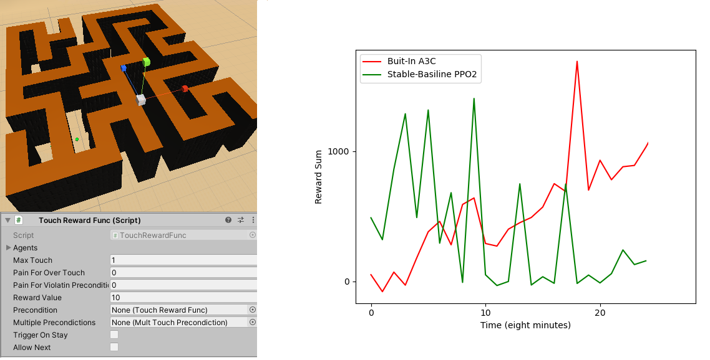
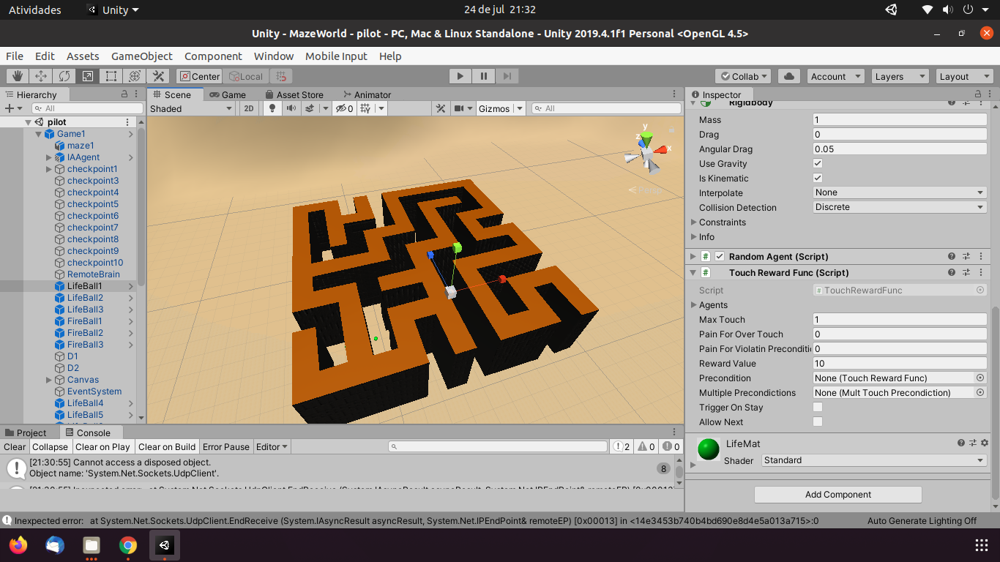

# MazeWorldBasic: A Simple Maze Exploration to Reinforcement Learning Algorithms.

This is a simple but challenging game for reinforcement learning algorithms. An agent with first-person vision navigates a maze in search of a way out. The agent has to find the way out before his energy runs out. The agent's energy decreases with each action performed or when the agent captures red spheres, but increases when the agent captures green spheres.

# Action Space

* Discret (gym)
* 0: walk
* 1: run
* 2: walk_in_circle (1 to right)
* 3: walk_in_circle (-1 to left)
* 4: NoOp (IDLE)

# State Space

User can define an observation_space. In our model, **1** images with **20 x 20** pixels is generated by casting rays from the agent's eye position. For this, one uses asymmetrical frustum with a 90-degree aperture angle, as shown in the next figure. The distance from the eye to the image plane is **d**.

Agent's implementation uses as input sequences of **4** frames from the model view.

Therefore, spacte state is a Box with the shape **20x20x4**.

# Agent Implementation

Folder **Agents** contains A3C, and PPO2 based agents for this environment. The next image shows the training progress using the examples a3c_agent.py, and ppo2_agent.py.

# Environment Implementation
Environment Unity Project is in **MazeWorld** folder. The next figure shows same images this environment.

